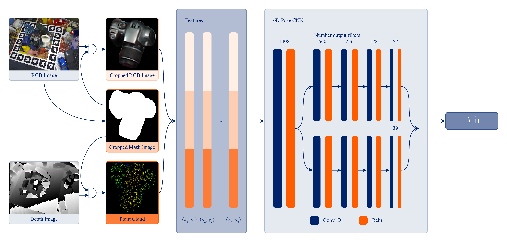

# MaskedFusion

<p align="center">
	
</p>


This repository is the implementation code of the paper "MaskedFusion: Mask-based 6D Object Pose Detection", available on [arXiv](https://arxiv.org/abs/1911.07771).


## Overview

MaskedFusion is a framework to estimate 6D pose of objects using RGB-D data, with an architecture that leverages multiple stages in a pipeline to achieve accurate 6D poses. 6D pose estimation is an open challenge due to complex world objects and many possible problems when capturing data from the real world, e.g., occlusions, truncations, and noise in the data. Achieving accurate 6D poses will improve results in other open problems like robot grasping or positioning objects in augmented reality. MaskedFusion improves upon DenseFusion where the key differences are in pre-processing data before it enters the Neural Network (NN), eliminating non-relevant data, and adding additional features extracted from the mask of the objects to the NN to improve its estimation. It achieved 5.9mm average error on the widely used LineMOD dataset, wich is an improvement of more than 20%, compared to the state-of-the-art method, DenseFusion.


## Requirements

* PyTorch 0.4.1
* PIL
* scipy
* numpy
* pyyaml
* logging


## Code

Since our code was initially based on the [DenseFusion](https://github.com/j96w/DenseFusion/blob/master/README.md) structure, some issues that you can happen to have, might have been solved already in their [GitHub](https://github.com/j96w/DenseFusion/) Issue Page.


## Dataset

LineMOD: Download the preprocessed LineMOD dataset.

Download preprocessed LineMOD dataset using:
```
sh download_linemod_preprocessed.sh
```


## Train on LineMOD Dataset

Just run:
```
sh experiments/scrips/train_linemod.sh
```


## Citations

If you use this code, please cite:
```
@article{pereira2019maskedfusion,
     title={Masked{F}usion: Mask-based 6D Object Pose Detection},
     author={Nuno Pereira and Lu\'is A. Alexandre},
     url       = {http://arxiv.org/abs/1911.07771},
     journal   = {CoRR},
     volume    = {abs/1911.07771},
     year={2019},
     eprint={1911.07771},
     archivePrefix={arXiv},
     primaryClass={cs.CV}
}
```


## Acknowledgments

This work was supported by project 026653 (POCI-01-0247-FEDER-026653) INDTECH 4.0 - New technologies for smart manufacturing, cofinanced by the Portugal 2020 Program (PT 2020), Compete 2020 Program and the European Union through the European Regional Development Fund (ERDF).

We are also, very thankful to the authors of [DenseFusion](https://github.com/j96w/DenseFusion/) for making their source code available.


