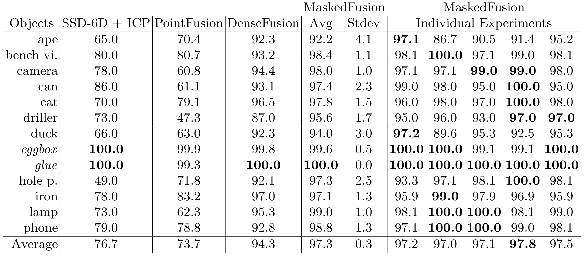

# MaskedFusion

<p align="center">
	
</p>

__This repository is the implementation code of the paper "MaskedFusion: Mask-based 6D Object Pose Estimation", available on [arXiv](https://arxiv.org/abs/1911.07771).__


## Overview

MaskedFusion is a framework to estimate the 6D pose of objects using RGB-D data, with an architecture that leverages multiple sub-tasks in a pipeline to achieve accurate 6D poses. 6D pose estimation is an open challenge due to complex world objects and many possible problems when capturing data from the real world, e.g., occlusions, truncations, and noise in the data. Achieving accurate 6D poses will improve results in other open problems like robot grasping or positioning objects in augmented reality. MaskedFusion improves the state-of-the-art by using object masks to eliminate non-relevant data. With the inclusion of the masks on the neural network that estimates the 6D pose of an object we also have features that represent the object shape. MaskedFusion is a modular pipeline where each sub-task can have different methods that achieve the objective. MaskedFusion achieved 97.3% on average using the ADD metric on the LineMOD dataset and 93.3% using the ADD-S AUC metric on YCB-Video Dataset, which is an improvement, compared to the state-of-the-art methods. 


## Our Results

### LineMOD Dataset

Quantitative evaluation of 6D pose using the ADD metric on theLineMOD dataset. Symmetric objects are presented in italic and were evaluated using ADD-S. Bold shows best results in a given row.

<p align="center">
	
</p>


### YCB-Video Dataset

Quantitative evaluation of 6D pose (area under the ADD-S curve(AUC)) on the YCB-Video Dataset. Bold numbers are the best in a row and underline numbers are the best when comparing MaskedFusion with DenseFusion both with 100 training epochs. The last column of the table is the evaluation of MaskedFusion using the masks that were generated by our first sub-task during the train and test.

<p align="center">
	
</p>


## Requirements

* PyTorch
* PIL
* scipy
* numpy
* pyyaml
* Cuda 10+

```
pip install -U -r requirements.txt
```


## Dataset

Download preprocessed LineMOD and YCB-Video dataset using:

```
sh download_datasets.sh
```


## Train

### Train on LineMOD Dataset

Just run:

```
sh experiments/scrips/train_linemod.sh
```


### Train on YCB-Video Dataset

Just run:

```
sh experiments/scrips/train_ycb.sh
```


## Code

Since our code was initially based on the [DenseFusion](https://github.com/j96w/DenseFusion/blob/master/README.md) structure, some issues that you can happen to have, might have been solved already in their [GitHub](https://github.com/j96w/DenseFusion/) Issue Page.


## Citations

If you use this code, please cite:

```
@inproceedings{pereira2020maskedfusion,
    title={Masked{F}usion: Mask-based 6D Object Pose Estimation},
    author={Nuno Pereira and Lu\'is A. Alexandre},
    booktitle={19th IEEE International Conference on Machine Learning and Applications (ICMLA 2020)},
    month={December},
    year={2020}
}
```


## Acknowledgments

This work was supported by project 026653 (POCI-01-0247-FEDER-026653) INDTECH 4.0 - New technologies for smart manufacturing, cofinanced by the Portugal 2020 Program (PT 2020), Compete 2020 Program and the European Union through the European Regional Development Fund (ERDF).

We are also, very thankful to the authors of [DenseFusion](https://github.com/j96w/DenseFusion/) for making their source code available.

